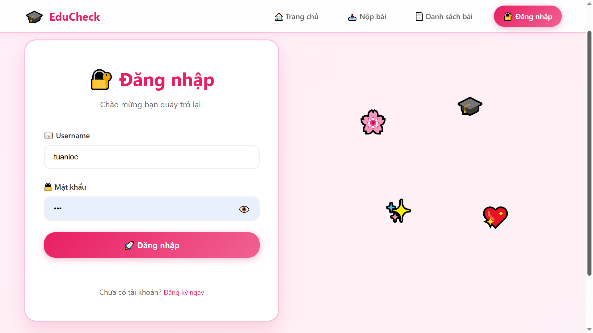
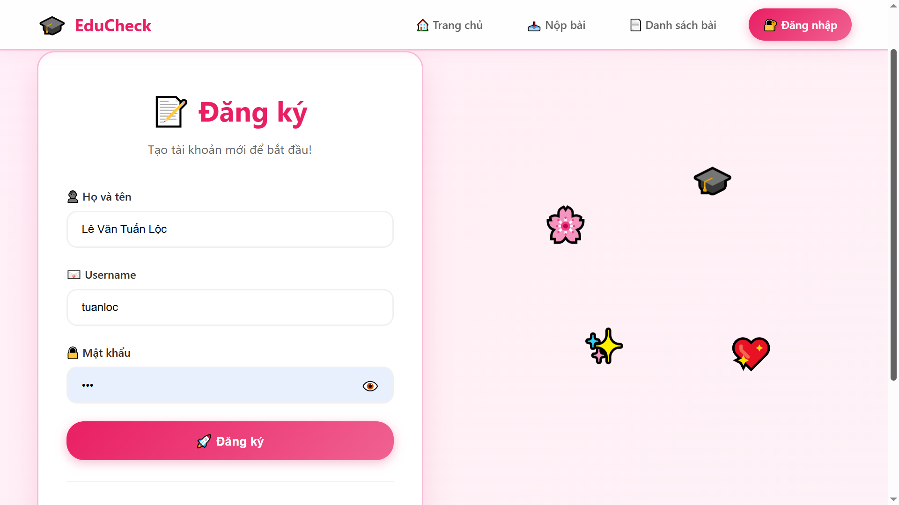
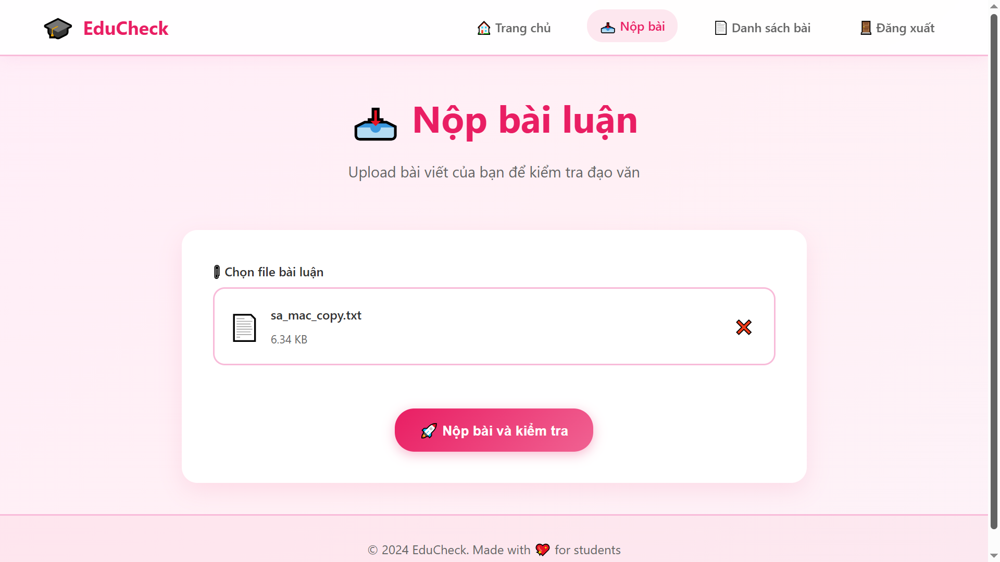
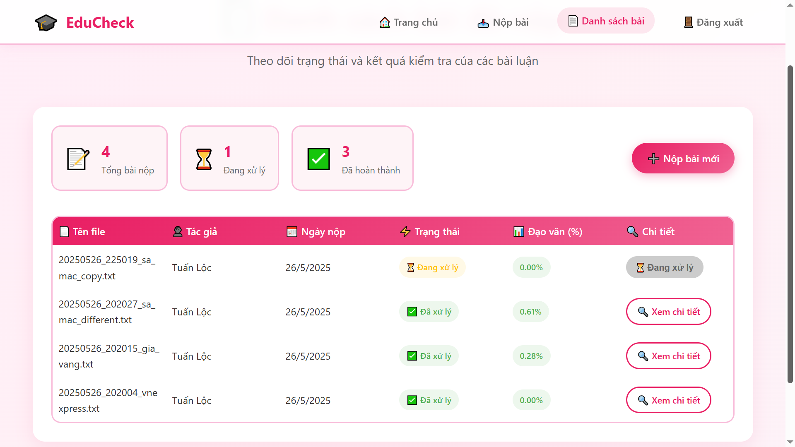
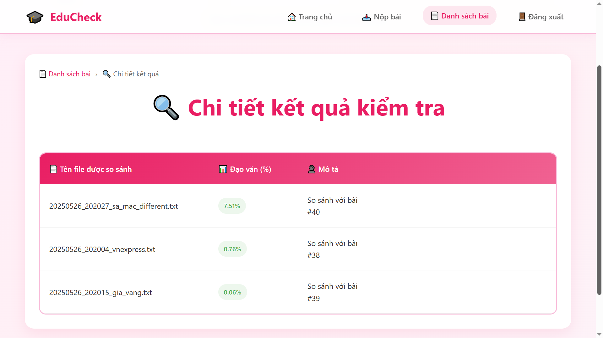
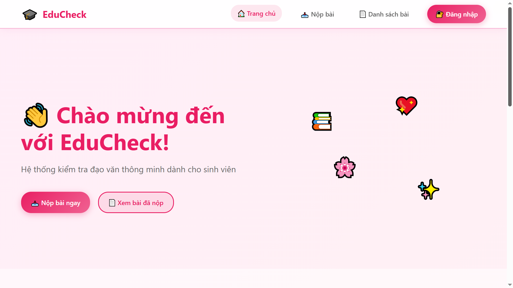
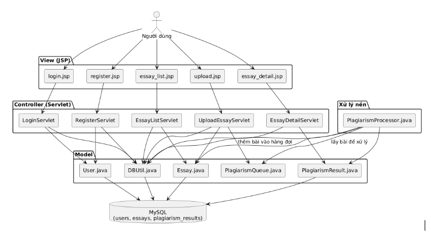

# Hệ thống kiểm tra đạo văn - Plagiarism Detection System

Một hệ thống phát hiện đạo văn sử dụng Java Servlet + JSP và MySQL, hoạt động theo mô hình MVC. Khi người dùng nộp bài, hệ thống sẽ lưu vào cơ sở dữ liệu và đưa vào hàng đợi để xử lý kiểm tra đạo văn tự động.

## 🎓 Chức năng của người dùng

### 🟩 Đăng nhập, Đăng ký

---

### 🟩 Nộp bài luận

📥 Nộp bài viết dạng `.txt` hoặc `.docx`

- Giao diện chọn file để tải lên
- Gửi bài → Hệ thống lưu trữ vào cơ sở dữ liệu + xếp vào **hàng đợi xử lý đạo văn**

---

### 🟩 Danh sách bài đã nộp

📄 Hiển thị:

- Tên file
- Ngày nộp
- Trạng thái xử lý: `Đang xử lý` / `Đã xử lý`
- Tỷ lệ đạo văn (nếu có)
- Nút “Xem chi tiết” kết quả

---

### 🟩 Page 5: Xem chi tiết kết quả đạo văn

🔎 Hiển thị:

- Tên bài trùng lặp và tỷ lệ trùng lặp
- Ghi chú (ví dụ: “So sánh với bài 123”)

---

## ✅ Giao diện người dùng đơn giản, dễ sử dụng

**Menu chính:**

- Trang chủ
- Nộp bài
- Danh sách bài đã nộp
- Đăng xuất

Danh sách bài hiển thị trạng thái và tỷ lệ đạo văn, khi bấm vào sẽ chuyển sang trang chi tiết.

---

## 🛠️ Cài đặt & chạy thử

1. Cài đặt **Tomcat** (v9+)
2. Import project vào **IDE (Eclipse/IntelliJ)**
3. Import file `plagiarism.sql` để tạo database trong MySQL
4. Chạy project trên Tomcat, truy cập `http://localhost:8080/Plagiarism-Detection-System`

---

## 🧠 Xử lý nền

Hệ thống có sử dụng hàng đợi và xử lý ngầm (`PlagiarismProcessor.java`) để kiểm tra đạo văn. Kết quả sẽ được cập nhật lại khi xử lý hoàn tất.

---

## 📌 Sơ đồ kiến trúc

---
